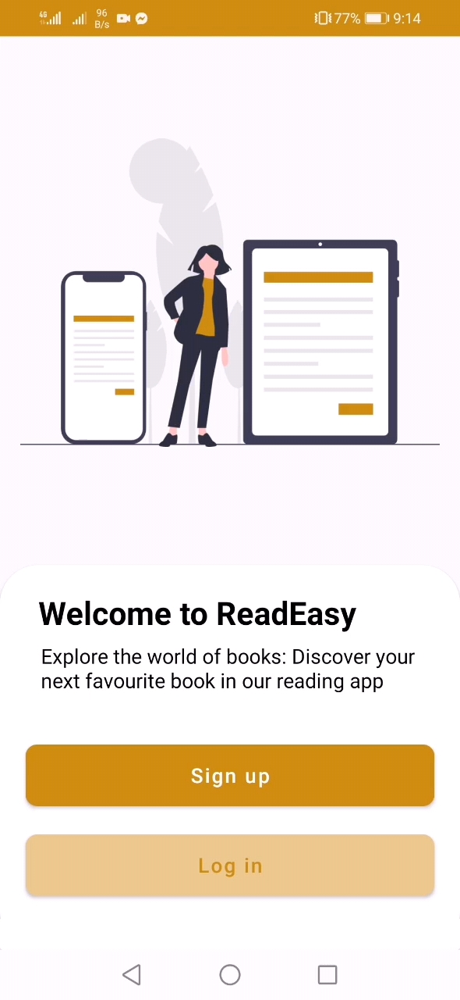
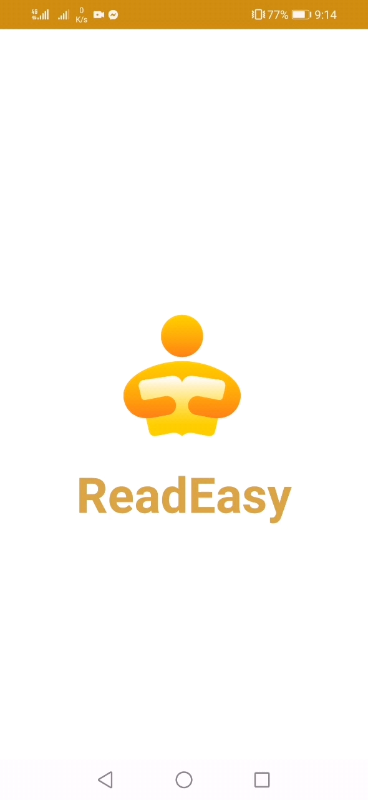
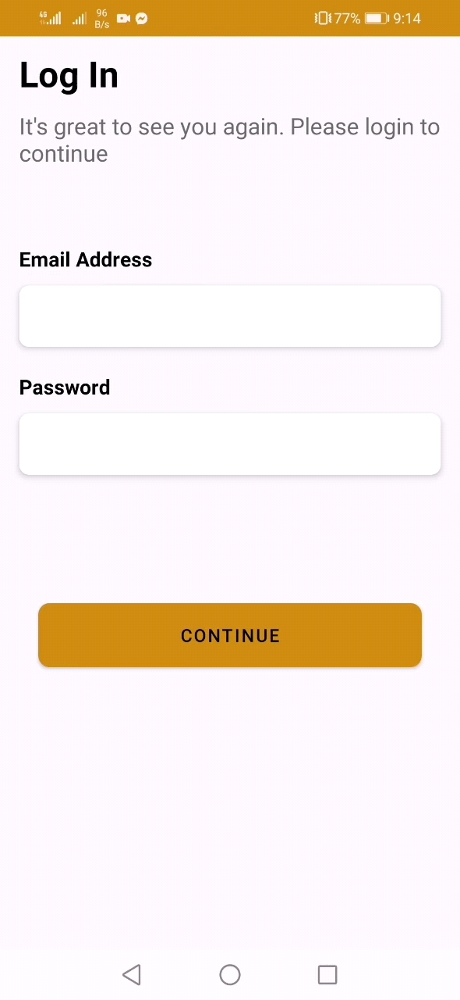
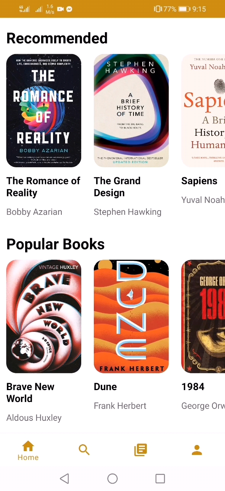
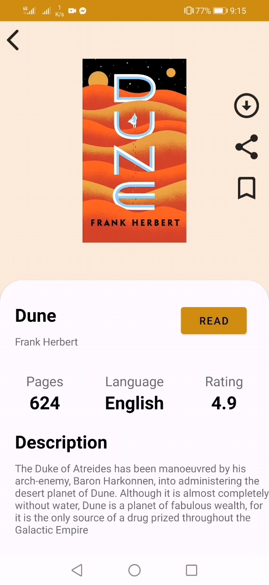
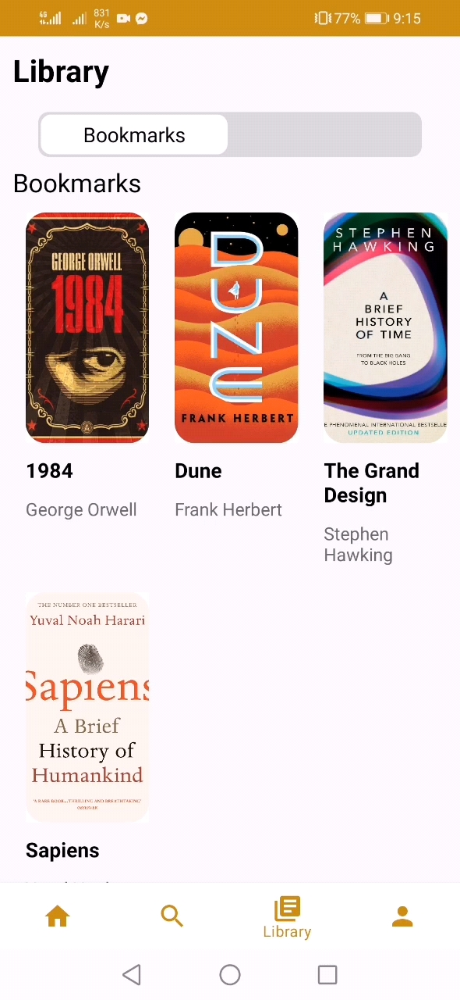

### ReadEasy

ReadEasy is an Android application built with Java that lets users browse, download, and read PDF documents. It uses Firebase for authentication, realtime database, and storage.

---

### Features
- **Authentication**: Sign up / log in with Firebase Auth
- **Browse & Search**: Discover PDFs by category or keyword
- **Download & Read**: In‑app PDF viewing with `android-pdf-viewer`
- **Library Management**: Saved downloads and recently viewed items
- **Sharing**: Share PDF links with others

---

### Tech Stack
- **Language**: Java
- **Minimum SDK**: 28
- **Target/Compile SDK**: 33
- **UI**: AndroidX, Material Components, ConstraintLayout, ViewBinding
- **Backend**: Firebase (Analytics, Auth, Realtime Database, Storage)
- **Imaging**: Glide, Picasso, Blurry
- **Networking**: Volley
- **PDF Rendering**: `com.github.barteksc:android-pdf-viewer:3.2.0-beta.1`

---

### Screenshots

  
  
  
  
  
  
  

---

### Requirements
- Android Studio (Giraffe+ recommended)
- Java 8 compatibility (configured via Gradle)
- Android SDK Platform 33
- A Firebase project with Android app configured

---

### Quick Start
1. Clone the repo and open the root folder in Android Studio.
2. Ensure `compileSdk` and `targetSdk` 33 are installed in the SDK Manager.
3. Create a Firebase project and add an Android app with the package name `com.example.readeasy` (or update `applicationId` in `app/build.gradle` to match your configured Firebase app).
4. Download `google-services.json` from Firebase console and place it in `app/google-services.json` (already present in this repo as a placeholder; replace with your file).
5. Sync Gradle. Build and run on a device/emulator (Android 9+, API 28+).

---

### Firebase Setup
- Enable the following in Firebase console:
  - Authentication (Email/Password or your preferred provider)
  - Realtime Database (set rules appropriately for your testing/production)
  - Storage (set rules and create a bucket for PDFs)
- Update any hardcoded database/storage paths in code if you change structure.

---

### Project Structure (high-level)
- `app/src/main/java/com/example/readeasy`
  - `Adapters/` RecyclerView adapters (e.g., `SearchPdfAdapter`, `TopAdapter`)
  - `Models/` Data models (e.g., `ModelPdf`, `ModelCategory`)
  - Core Activities: `MainActivity`, `IntroActivity`, `LoginSignUpActivity`, `UploadActivity`, `BookDetailsActivity`, `ReadActivity`
  - Fragments: `HomeFragment`, `SearchFragment`, `LibraryFragment`, `ProfileFragment`
  - `Filters/` (e.g., `PdfFilter`)
- `app/src/main/res/` UI resources (layouts, drawables, values)
- `app/src/main/AndroidManifest.xml` app manifest and permissions

---

### Key Permissions
Declared in `AndroidManifest.xml`:
- `INTERNET`, `ACCESS_NETWORK_STATE`, `ACCESS_WIFI_STATE`
- `READ_EXTERNAL_STORAGE`, `WRITE_EXTERNAL_STORAGE` (for legacy downloads; consider scoped storage or `READ_MEDIA_*` on newer SDKs)

---

### Notable Dependencies
- `com.google.firebase:firebase-analytics:19.0.0`
- `com.google.firebase:firebase-auth:21.0.1`
- `com.google.firebase:firebase-database:20.0.0`
- `com.google.firebase:firebase-storage:20.0.0`
- `com.github.barteksc:android-pdf-viewer:3.2.0-beta.1`
- `com.github.bumptech.glide:glide:4.15.1`
- `com.squareup.picasso:picasso:2.8`
- `jp.wasabeef:blurry:2.1.1`
- `com.android.volley:volley:1.2.1`

All are declared in `app/build.gradle`.

---

### Build & Run
1. From Android Studio, click Sync to fetch dependencies.
2. Use a device/emulator on API 28+.
3. Run the `app` configuration. The launcher activity is `MainActivity` / `IntroActivity` per manifest.

---

### Troubleshooting
- Gradle sync issues: Ensure Google Maven and Maven Central are enabled; use the Android Gradle Plugin compatible with your Android Studio version.
- Firebase initialization errors: Confirm `google-services.json` is present under `app/` and the package name matches your Firebase app.
- Storage permission errors (Android 10+): Consider using scoped storage APIs or migrating to `READ_MEDIA_DOCUMENTS` on newer SDKs.
- PDF rendering issues: Verify the PDF file is accessible and not corrupted; test with a local sample.

---

### Contributing
Issues and pull requests are welcome. Please describe your change clearly and include before/after behavior.

---

### License
Add your preferred license here (e.g., MIT). If you already have a license file, reference it and keep the headers in source files consistent.
